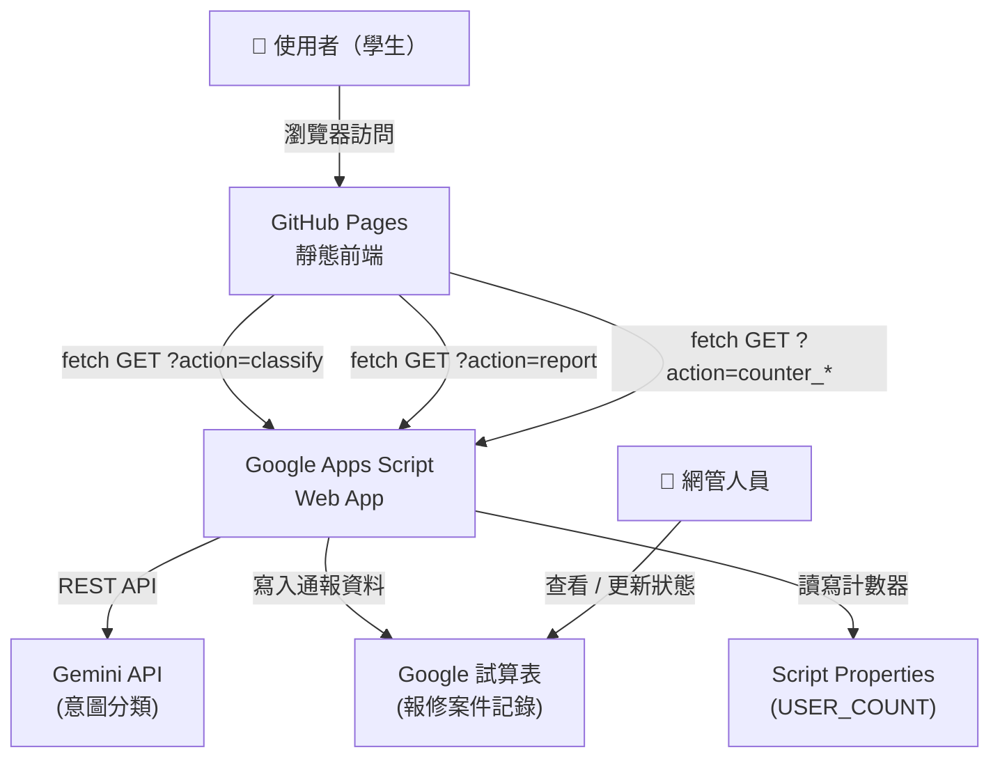

# 架構設計文件

**版本**：1.0  
**建立日期**：2026-07-17

---

## 1. 系統架構概覽



---

## 2. 技術選型

| 層次 | 技術 | 說明 |
|---|---|---|
| 前端 | HTML5 + Vanilla CSS + Vanilla JS | 無框架依賴，輕量部署 |
| 部署 | GitHub Pages | 免費靜態托管 |
| LLM | Gemini 1.5 Flash API | 透過 GAS 代理，Key 不外露 |
| 後端 | Google Apps Script (GAS) | 免費、無需伺服器 |
| 資料儲存 | Google 試算表 | 報修案件；Script Properties 儲存計數器 |

---

## 3. 核心模組職責

### 3.1 前端模組（`js/`）

| 模組 | 職責 |
|---|---|
| `config.js` | 集中管理 GAS URL、PDF 連結、回覆文字 |
| `chat.js` | 對話流程控制、訊息渲染、按鈕互動、打字指示器 |
| `intent.js` | 呼叫 GAS 進行意圖分類，回傳標準意圖代碼 |
| `report.js` | 報修表單 Modal 開關、前端驗證、送出至 GAS |
| `counter.js` | 讀取 / 累加使用人數，更新 Header 數字 |

### 3.2 後端（`gas/Code.gs`）

| 函式 | 職責 |
|---|---|
| `doGet(e)` | 路由 GET 請求至對應功能 |
| `classifyIntent(msg)` | 呼叫 Gemini API，回傳意圖代碼 |
| `writeReport(data)` | 將報修資料附加至試算表 |
| `getCounter()` | 讀取 Script Properties 中的計數器 |
| `incrementCounter()` | 累加計數器 |

---

## 4. 資料流

### 4.1 使用者點擊按鈕

```
使用者點擊按鈕
→ chat.js _handleButtonClick()
→ 顯示打字指示器（模擬思考）
→ 渲染 Bot 回覆或開啟報修表單
```

### 4.2 使用者輸入文字（意圖分類）

```
使用者輸入
→ chat.js _handleTextInput()
→ 顯示打字指示器
→ intent.js classify()
→ GAS doGet(?action=classify&msg=...)
→ GAS classifyIntent() → Gemini API
→ 回傳意圖代碼
→ chat.js 根據意圖渲染對應回覆
```

### 4.3 報修送出

```
使用者填寫表單 → 點擊送出
→ report.js 前端驗證（必填欄位）
→ fetch GAS doGet(?action=report&payload=...)
→ GAS writeReport() → 試算表 appendRow()
→ 回傳 {success:true}
→ 關閉 Modal，顯示成功訊息
```

---

## 5. 安全性設計

- Gemini API Key 僅存於 **GAS Script Properties**，不寫入任何程式碼或 Git
- GAS Web App 設定「誰可以存取：所有人」以允許前端呼叫
- 前端不持有任何機密資訊
- `.env` 加入 `.gitignore`

---

## 6. 部署流程

```
1. 完成本地開發 → git push feature/chatbot-init
2. 開 Pull Request → main
3. 合併後：Settings → Pages → Source: main / (root)
4. 部署 GAS，取得 Web App URL
5. 更新 js/config.js → GAS_URL
6. 再次 commit + push
```
