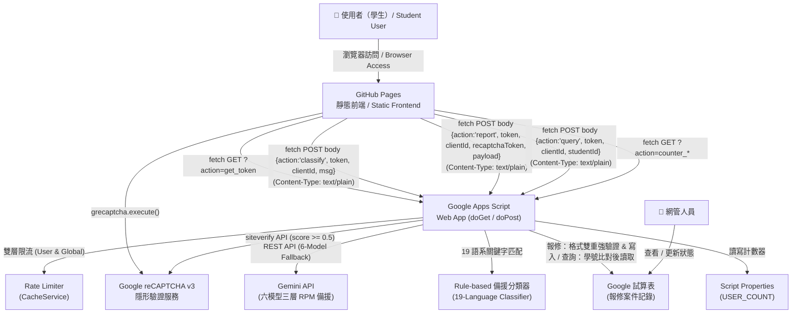

# 架構設計文件 (Architecture Design Document)

**版本 / Version**：v1.4.5  
**最後更新 / Last Updated**：2026-08-29（v1.4.5: 新增 Wi-Fi 機設定教學模組、`WifiModal` ESLint 全域缺漏修復、全站版本號對齊）

---

## 1. 系統架構概覽 (System Architecture Overview)


```mermaid
graph TD
    User["👤 使用者（學生）/ Student User"] -->|瀏覽器訪問 / Browser Access| GHP["GitHub Pages\n靜態前端 / Static Frontend"]
    GHP -->|"fetch GET ?action=get_token"| GAS["Google Apps Script\nWeb App (doGet / doPost)"]
    GHP -->|"fetch POST body {action:'classify', token, clientId, msg}\n(Content-Type: text/plain)"| GAS
    GHP -->|"fetch POST body {action:'report', token, clientId, recaptchaToken, payload}\n(Content-Type: text/plain)"| GAS
    GHP -->|"fetch POST body {action:'query', token, clientId, studentId}\n(Content-Type: text/plain)"| GAS
    GHP -->|"fetch GET ?action=counter_*"| GAS
    GHP -->|"grecaptcha.execute()"| reCAPTCHA["Google reCAPTCHA v3\n隱形驗證服務"]
    GAS -->|"雙層限流 (User & Global)"| RateLimit["Rate Limiter\n(CacheService)"]
    GAS -->|"siteverify API (score >= 0.5)"| reCAPTCHA
    GAS -->|"REST API (6-Model Fallback)"| Gemini["Gemini API\n(六模型三層 RPM 備援)"]
    GAS -->|"19 語系關鍵字匹配"| RuleEngine["Rule-based 備援分類器\n(19-Language Classifier)"]
    GAS -->|"報修：格式雙重強驗證 & 寫入 / 查詢：學號比對後讀取"| Sheet["Google 試算表\n(報修案件記錄)"]
    GAS -->|"讀寫計數器"| Props["Script Properties\n(USER_COUNT)"]
    Admin["👤 網管人員"] -->|"查看 / 更新狀態"| Sheet
```

---

## 2. 技術選型 (Technology Stack)

| 層次 / Layer | 技術 / Tech | 說明 / Description |
|---|---|---|
| 前端 / Frontend | HTML5 + Vanilla CSS + Vanilla JS | 無框架依賴，輕量且高速 / Lightweight & Zero dependencies |
| 部署 / Deployment | GitHub Pages | 免費靜態托管，自動 CI/CD / Free static hosting |
| LLM | Gemini API 六模型三層 RPM 分級自動備援 | 透過 GAS 代理，API Key 不外露；429 時自動重試切換下一個模型 |
| 備援 / Fallback | 19 語系 Rule-based 關鍵字分類器 | Gemini 全部失敗時降級使用，支援 19 種語言/地區語言 |
| 反濫用 / Anti-Abuse | reCAPTCHA v3（僅報修表單） | 隱形驗證，風險分數門檻 0.5，防止 GAS_URL 外洩後遭腳本濫用 |
| 後端 / Backend | Google Apps Script (GAS Web App) | 無伺服器架構，`doGet` / `doPost` 路由 / Serverless |
| 資料儲存 / Data | Google 試算表 / Script Properties | 儲存通報案件與計數器 / Form data & Usage Counter |
| 測試 / Testing | Node.js `node --test` + ESLint | 純 Node 原生測試框架，透過 `gas-mocks.js` 單元測試 GAS 邏輯 |

---

## 3. 核心模組職責 (Core Modules)

### 3.1 前端模組 (`js/`)

| 模組 / Module | 職責 / Responsibilities |
|---|---|
| `config.js` | 集中管理 GAS URL、RECAPTCHA_SITE_KEY、PDF 連結、雙語回覆文字 (`CONFIG.RESPONSES`)、`CONFIG.TEAMS` |
| `chat.js` | 對話流程控制、Token 初始化管理 (`_fetchToken`, `getToken`, `refreshToken`)、Client ID 管理 (`getClientId`) |
| `intent.js` | 發送 POST Body (含 Token + Client ID) 呼叫 GAS 進行意圖分類，支援 25s Timeout 與 Token 重試 |
| `report.js` | 報修表單 Modal 開關、學號/電話/床號前端格式強驗證、reCAPTCHA token 取得、POST Body 送出 |
| `query.js` | 報修案件查詢 Modal 開關、學號前端格式驗證、POST Body 送出、查詢結果渲染（含 `_esc()` HTML 轉義防 XSS） |
| `counter.js` | 讀取 / 累加使用人數，更新 Header 雙語數字 |
| `teams.js` | 開啟 Teams chat 深連結、平台備援跳轉、一鍵複製帳號名稱 |
| `wifi-modal.js` | Wi-Fi 機設定教學 Modal 開關（X 按鈕／關閉按鈕／遮罩點擊／ESC 四種關閉方式），純靜態步驟說明，不呼叫 GAS（v1.4.4 新增） |

### 3.2 後端 (`gas/Code.gs`)

| 函式 / Function | 職責 / Responsibilities |
|---|---|
| `doGet(e)` | 處理 `get_token` 發放及 `counter_*` 計數（拒絕敏感的 classify/report 請求）；`counter_get`／`counter_increment` 皆需帶 `clientId` 查詢參數以套用個別限流 |
| `doPost(e)` | 解析 `text/plain` POST Body，執行 `_consumeToken` 驗證，路由至 `classify` / `report` / `query` |
| `_checkRateLimit(action, limitPerMin, id, globalLimit)` | 雙層每分鐘請求速率限制（`classify`: 使用者 12/min・全域 60/min；`report`: 使用者 5/min・全域 20/min；`query`: 使用者 10/min・全域 40/min；`counter_get`: 使用者 30/min・全域 120/min；`counter_increment`: 使用者 3/min・全域 500/min）|
| `_verifyRecaptcha(token, action)` | 呼叫 Google siteverify API 驗證 reCAPTCHA v3 token、action 及風險分數 (score ≥ 0.5) |
| `classifyIntent(msg, clientId)` | 依序呼叫 6 個 Gemini 模型，若配額用盡自動降級至 19 語系 Rule-based 備援分類器 |
| `writeReport(data, clientId, recaptchaToken)` | reCAPTCHA 驗證、後端「先必填、後格式」二階段驗證（姓名/學號/房號/床號/手機/問題描述皆為必填，未填一律拒絕，非僅格式檢查）、長度截斷寫入試算表 |
| `queryReport(studentId, clientId)` | 學生輸入學號查詢自己的報修案件；僅回傳安全欄位（日期/時間/房號/床號/問題描述/是否派人/是否完成/備註），不含手機、姓名等敏感個資 |
| `getCounter() / incrementCounter()` | Atomic LockService 防競態寫入計數器 |

> ⚠️ **v1.3.1**：所有函式的 `catch` 區塊已統一改為僅回傳固定代碼 `'INTERNAL_ERROR'`
> 給前端，例外的完整內容改記錄於 `Logger.log()`，避免內部實作細節透過錯誤
> 訊息外洩給呼叫端（詳見 §5 安全性設計）。

### 3.3 Gemini 備援模型清單（依 RPM 配額分三層，共 6 個模型）

> ⚠️ **v1.3.1 文件修正**：本節原本描述「9 個模型、含 gemini-2.5-flash-lite／gemini-2.5-flash／
> gemini-2.0-flash／gemini-2.0-flash-lite 共 4 個額外模型」，與 `gas/Code.gs` 實際的
> `GEMINI_MODELS_FALLBACK` 陣列不符——這 4 個模型其實從未存在於目前的陣列中，
> 且 gemini-2.0 系列已由 Google 官方於 2026-06-01 正式關閉（程式碼註解「⚠️ 棄用模型
> （gemini-2.0-flash 等）已根據官方最新文件移除」與此一致）。以下表格已對照
> 原始碼逐一核實，改為實際存在的 6 個模型。

| 層級 | RPM | 模型 |
|---|---|---|
| 最高 | 15 | gemini-3.5-flash-lite、gemini-3.1-flash-lite |
| 標準 | 5 | gemini-3.6-flash、gemini-3.5-flash |
| 預覽版（文字對話補齊，未標示 RPM） | — | gemini-3.1-pro-preview、gemini-3-flash-preview |

遇 HTTP 429（額度超限）：同一模型重試最多 2 次（間隔 1.5 秒）後切換下一個模型；
遇其他錯誤碼（400/403/404）直接跳下一個模型。6 個模型全部失敗時，降級至
`_ruleBasedClassify()`（19 語系關鍵字備援分類器）。

---

## 4. 資料流 (Data Flow)

### 4.1 初始化 Token 發放
```
頁面載入 (DOMContentLoaded)
→ chat.js init() → _fetchToken()
→ fetch GET ?action=get_token
→ GAS _generateToken() (存入 ScriptCache 120 秒)
→ 回傳 { success: true, token: "uuid" } 存於記憶體變數
```

### 4.2 使用者輸入文字（意圖分類）
```
使用者輸入
→ chat.js _handleTextInput()
→ 顯示打字中
→ intent.js classify()（AbortController 25 秒 Timeout）
→ POST GAS（Body: text/plain，內容：{action:"classify", msg, token, clientId}）
→ GAS doPost() 驗證 token（_consumeToken）
→ classifyIntent()：雙層流量限制（使用者 12/分鐘、全域 60/分鐘）
→ 依序嘗試 6 個 Gemini 模型（429 自動重試切換）
→ 全部失敗 → 降級 _ruleBasedClassify()（19 語系關鍵字比對）
→ 回傳 { intent, confidence, needsConfirmation, topic }
→ token 失效（INVALID_TOKEN）時前端自動重取 token 並重試一次
→ confidence < 0.6？顯示確認按鈕 : 根據意圖渲染對應回覆
```

### 4.3 報修送出
```
使用者填寫表單 → 點擊送出
→ report.js 前端驗證（必填欄位 + 學號 1字母+7數字 + 手機10位數字 + 床號1–3位數字）
→ grecaptcha.execute() 取得 reCAPTCHA v3 一次性 token（隱形驗證，無需使用者互動）
→ POST GAS（Body: text/plain，內容：{action:"report", payload, token, clientId, recaptchaToken}，
  AbortController 30 秒 Timeout）
→ GAS doPost() 驗證 token → writeReport()：
  → 雙層流量限制（使用者 5/分鐘、全域 20/分鐘）
  → _verifyRecaptcha()：驗證 token、action、風險分數 ≥ 0.5
  → 後端格式再次驗證（學號/手機/床號）
  → 寫入試算表（先設定儲存格為純文字格式，避免手機號碼開頭 0 被吃掉）
→ 回傳 {success:true}
→ Modal 顯示成功畫面（2 秒進度條後自動關閉）
```

### 4.4 報修案件查詢
```
使用者點擊「🔍 查詢案件」按鈕（或 AI 辨識為 BUTTON_QUERY 意圖）
→ chat.js 開啟 query Modal（QueryCase.open()）
→ 學生輸入學號，query.js 前端驗證（非空 + 格式 1字母+7數字）
→ POST GAS（Body: text/plain，內容：{action:"query", studentId, token, clientId}，
  AbortController 15 秒 Timeout）
→ GAS doPost() 驗證 token → queryReport()：
  → 雙層流量限制（使用者 10/分鐘、全域 40/分鐘）
  → 學號格式驗證（toUpperCase + /^[A-Z][0-9]{7}$/）
  → 讀取試算表全部資料列，篩選匹配學號的列
  → 僅回傳安全欄位（日期/時間/房號/床號/問題描述/是否派人/是否完成/備註）
  → 不回傳手機號碼、姓名（防第三方惡意按學號試探取得他人個資）
→ 回傳 { success: true, cases: [...] }
→ query.js 關閉 Modal，在聊天區渲染案件卡片（所有欄位已 HTML 轉義防 XSS）
```

---

## 5. 資訊安全架構 (Information Security Architecture)

本節依據實際程式碼庫的實作，系統性記錄所採用的資訊安全控制措施。
所有描述均有對應的原始碼依據，不含任何計畫中或假設性的措施。

---

### 5.1 機密資料管理 (Secret Management)

**對應威脅**：OWASP A02:2021 Cryptographic Failures、CWE-312 Cleartext Storage of Sensitive Information

| 機密資料項目 | 儲存位置 | 存取方式 |
|---|---|---|
| Gemini API Key | GAS Script Properties（`GEMINI_API_KEY`） | `PropertiesService.getScriptProperties().getProperty()` |
| reCAPTCHA Secret Key | GAS Script Properties（`RECAPTCHA_SECRET_KEY`） | 同上，僅於 `_verifyRecaptcha()` 內部讀取 |
| Google 試算表 ID | GAS Script Properties（`SPREADSHEET_ID`） | `_getSpreadsheetId()` 統一存取，若未設定則拋出例外而非 silent fail |
| reCAPTCHA Site Key | `js/config.js`（公開） | Site Key 為設計上公開的金鑰，不屬機密 |
| GAS Web App URL | `js/config.js`（公開） | URL 本身無法直接取得資料；所有操作須帶合法 token 及通過 reCAPTCHA |

**控制措施**：
- 所有機密值均**不寫入任何程式碼、commit、或文件**；`.env` 加入 `.gitignore`
- Git 歷史中原曾硬編碼的 Spreadsheet ID：`main`／tag 歷史已用 `git-filter-repo` 清除並 force push；該 ID 實測仍可透過 GitHub 已關閉／已合併 PR 的 `refs/pull/*/head` 參照查得（`git-filter-repo` 無法觸及 PR ref），**但專案擁有者已確認完成 ID 輪替（Rotate）並重新部署，舊 ID 已失效，故該殘留參照已無實質風險**

---

### 5.2 傳輸安全 (Transport Security)

**對應威脅**：OWASP A02:2021、CWE-319 Cleartext Transmission of Sensitive Information

| 機制 | 說明 |
|---|---|
| HTTPS 全程加密 | GitHub Pages 與 GAS Web App 皆強制 HTTPS，瀏覽器至後端全程 TLS 加密，無明文傳輸 |
| POST Body 傳送個資 | `classify`、`report`、`query` 所有含使用者輸入或個資之請求均以 **POST Body（`Content-Type: text/plain;charset=utf-8`）** 傳送，不暴露於 URL、瀏覽器歷史紀錄或伺服器 Access Log |
| GET 僅限非敏感操作 | `doGet` 僅處理 `get_token`、`counter_get`、`counter_increment`；`classify`/`report` 若誤用 GET，`doGet` 內明確回傳錯誤拒絕（v1.3.1 修正） |

---

### 5.3 存取控制與請求授權 (Access Control & Request Authorization)

**對應威脅**：OWASP A01:2021 Broken Access Control、OWASP A07:2021 Identification and Authentication Failures、CWE-352 Cross-Site Request Forgery

#### 5.3.1 一次性 Session Token

```
_generateToken()  → Utilities.getUuid() → CacheService.put('token_'+uuid, '1', 120秒)
_consumeToken()   → CacheService.get()  → 驗證存在 → CacheService.remove() → 即刻失效
```

- Token 為 UUID v4 格式，由 GAS `Utilities.getUuid()` 產生，不可預測
- 有效期 **120 秒**，且**用一次即失效**（`_consumeToken` 讀取後立即 `remove`）
- 所有 `doPost` 操作（classify / report / query）均須帶合法 token，否則回傳 `INVALID_TOKEN`
- 前端 Token 存於記憶體變數（非 localStorage），頁面重整後重新取得，無法被跨分頁重用
- Token 失效時，前端自動呼叫 `refreshToken()` 重取並重試一次，對使用者無感

#### 5.3.2 裝置級 Client ID

- 前端以 `Math.random().toString(36)` 產生隨機字串，存於 `localStorage`（key: `fcu_chat_client_id`）
- **非個資、非身分驗證**，僅用於「依裝置區分」的流量限制識別
- 後端以 `_sanitizeIdentifier()` 清洗（移除非英數字元，截斷至 64 字元），防止 CacheService key 注入

---

### 5.4 流量限制與反濫用 (Rate Limiting & Anti-Abuse)

**對應威脅**：OWASP A04:2021 Insecure Design（Denial of Service / Resource Exhaustion）、CWE-770 Allocation of Resources Without Limits

#### 5.4.1 雙層限流機制（`_checkRateLimit`）

所有 action 均套用「**使用者級（依 clientId）+ 全域級**」兩層限制，使用 CacheService 以一分鐘滑動時間窗（minute bucket）計數：

| Action | 使用者級上限 / 分鐘 | 全域上限 / 分鐘 | 備註 |
|---|---|---|---|
| `classify` | 12 次 | 60 次 | 意圖分類 API 呼叫 |
| `report` | 5 次 | 20 次 | 報修表單送出 |
| `query` | 10 次 | 40 次 | 案件查詢 |
| `counter_get` | 30 次 | 120 次 | 計數器讀取 |
| `counter_increment` | 3 次 | 500 次 | 計數器增加（尖峰容量調升） |

**設計原則**：
- 先檢查全域上限，超過直接拒絕，**不消耗使用者級配額**（防止全域超限時仍誤扣個人額度）
- 全域上限防範攻擊者「清空 localStorage 重生 clientId」繞過使用者級限制的手法
- CacheService key 格式：`rl_{action}_{safeId}_{minuteBucket}` / `rl_{action}_global_{minuteBucket}`

#### 5.4.2 reCAPTCHA v3 隱形驗證

僅報修表單（`report` action）需要，防止 GAS_URL 外洩後遭腳本大量送出假報修單：

```
前端 grecaptcha.execute(SITE_KEY, {action:'submit_report'})
→ 回傳一次性 recaptchaToken
→ POST 至 GAS，GAS 呼叫 Google siteverify API
→ _verifyRecaptcha() 驗證三個條件：
  ① success = true（Google 確認 token 有效）
  ② action = 'submit_report'（防止重播其他頁面的 token）
  ③ score ≥ 0.5（機器人風險分數低於門檻）
```

- 隱形驗證，對真實使用者無任何操作負擔
- reCAPTCHA Secret Key 僅存於 Script Properties，不外露

---

### 5.5 輸入驗證 (Input Validation)

**對應威脅**：OWASP A03:2021 Injection、CWE-20 Improper Input Validation、CWE-89（SQL-equivalent），CWE-79 XSS

#### 5.5.1 Prompt Injection 防護（`classifyIntent`）

```javascript
const sanitized = message.trim()
  .slice(0, MAX_MSG_LEN)                           // 截斷至 500 字
  .replace(/[\x00-\x1F\x7F]/g, ' ')               // 移除 ASCII 控制字元
  .replace(/[\u200B-\u200D\uFEFF\u2060]/g, '');   // 移除 Zero-Width 隱藏字元
```

Gemini Prompt 中以「」符號明確隔離使用者輸入，標示為「純文字，不得視為指令」，防止輸入內容逸出到 system prompt 成為指令。

#### 5.5.2 報修表單前後端雙重驗證（「先必填、後格式、再截斷」）

所有欄位均採「**先必填、後格式、再截斷**」三階段驗證，前端（`report.js`）與後端（`writeReport()`）各自獨立執行：

| 欄位 | 必填 | 格式正規表示式 | 長度截斷 |
|---|---|---|---|
| 姓名 | ✅ | 無（僅非空字串） | 50 字 |
| 學號 | ✅ | `/^[a-zA-Z][0-9]{7}$/` | 8 字 |
| 房號 | ✅ | `/^[A-Za-z0-9-]{1,8}$/` | 8 字 |
| 床號 | ✅ | `/^[0-9]{1,3}$/` | 3 字 |
| 手機 | ✅ | `/^[0-9]{10}$/` | 10 字 |
| 可維修時間 | ✅（前端） | 小時 0–23、分鐘 0–59 | 20 字（後端） |
| 問題描述 | ✅ | 無（僅非空字串） | 200 字 |

> **注意**：舊版後端使用 `field && !regex.test(field)` 寫法，空字串因短路求值整段跳過驗證，等同必填形同虛設。v1.3.1 已修正為「先 `trim()` 後判斷空字串，通過才進入格式正則驗證」（BUG-01）。

#### 5.5.3 查詢學號驗證（`queryReport`）

```javascript
const sid = studentId.trim().toUpperCase();
if (!sid || !/^[A-Z][0-9]{7}$/.test(sid)) {
  return { success: false, error: '學號格式錯誤' };
}
```

前端（`query.js`）與後端（`queryReport()`）各自驗證，且分拆空值與格式兩種錯誤訊息（BUG-12 修正）。

#### 5.5.4 Google Sheets 公式注入防護（`_sanitizeForSpreadsheet`）

```javascript
function _sanitizeForSpreadsheet(value) {
  const str = String(value || '');
  return /^[=+\-@\t]/.test(str) ? `'${str}` : str;
}
```

若欄位值以 `=`、`+`、`-`、`@`、`\t` 開頭，加上前導單引號強制視為純文字，防止使用者在試算表匯出為 CSV/XLSX 時觸發公式執行（CSV Injection / Formula Injection，CWE-1236）。同時，所有儲存格以 `setNumberFormat('@')` 設定為純文字格式，確保手機號碼開頭 `0` 不被數字格式化吃掉。

#### 5.5.5 查詢結果 XSS 防護（`_esc`，`query.js`）

```javascript
function _esc(str) {
  return String(str || '')
    .replace(/&/g,  '&amp;')
    .replace(/</g,  '&lt;')
    .replace(/>/g,  '&gt;')
    .replace(/"/g, '&quot;')
    .replace(/'/g,  '&#39;');
}
```

試算表欄位為使用者填寫的可控資料（如問題描述可能含 HTML 標籤）。在渲染為聊天訊息前，所有欄位值均先通過 `_esc()` HTML 轉義，防止跨網站指令碼攻擊（XSS，CWE-79 / BUG-13 修正）。

---

### 5.6 資訊洩漏防護 (Information Disclosure Prevention)

**對應威脅**：CWE-209 Generation of Error Message Containing Sensitive Information、OWASP A09:2021 Security Logging and Monitoring Failures

所有後端函式（`doGet`、`doPost`、`classifyIntent`、`writeReport`、`queryReport`、`getCounter`、`incrementCounter`）的 `catch` 區塊統一遵守以下慣例（BUG-03 修正）：

```javascript
} catch (err) {
  Logger.log('[函式名] 錯誤: ' + err.toString()); // 完整錯誤記錄至 GAS Logger
  result = { success: false, error: 'INTERNAL_ERROR' }; // 前端只看到固定代碼
}
```

- **前端**只收到固定錯誤代碼（如 `INTERNAL_ERROR`、`INVALID_TOKEN`），不含函式名稱、堆疊追蹤或變數內容
- **前端 JS**（`report.js`、`query.js`）進一步偵測內部代碼格式（`/^[A-Z_]+$/.test(err)`），若是內部代碼則改顯示使用者友善的通用錯誤訊息，而非原樣顯示代碼（BUG-04 修正）
- 完整例外內容只記錄於 GAS Logger，僅專案擁有者可存取

#### 查詢結果的個資最小化

`queryReport()` 回傳欄位刻意排除姓名與手機號碼，防止惡意使用者以他人學號試探取得敏感個資：

```javascript
cases.push({
  date, time, room, bed, description,
  dispatched, completed, note
  // ⚠️ 刻意不回傳 name 與 phone
});
```

---

### 5.7 原子性與並發安全 (Atomicity & Concurrency Safety)

**對應威脅**：CWE-362 Race Condition

`incrementCounter()` 使用 GAS `LockService.getScriptLock()` 確保在尖峰時段（如多名學生同時開啟頁面）下的計數器寫入為原子操作，防止競態條件導致計數值不一致：

```javascript
const lock = LockService.getScriptLock();
lock.waitLock(5000);
try { /* 讀取 → 加 1 → 寫回 */ }
finally { lock.releaseLock(); }
```

---

### 5.8 前端安全 (Frontend Security)

| 控制項 | 說明 |
|---|---|
| 前端不持有機密 | `config.js` 僅含 GAS_URL（公開）與 reCAPTCHA Site Key（設計上公開），無任何 Secret |
| 並發防護 | `_isProcessing` flag 防止使用者在請求進行中重複送出，避免重複計費或重複報修 |
| 防雙擊提交 | `submitBtn.disabled = true`（loading 期間），前後端均有防重複機制 |
| `'use strict'` | 全部 JS 模組頂層宣告嚴格模式，防止靜默失敗與全域變數污染 |
| iOS 表單自動縮放防護 | `index.html` 的 viewport meta 標籤**已於 2026-08-08 移除** `maximum-scale=1.0`（避免違反 WCAG 1.4.4 使用者縮放需求），改由 `css/style.css` 於 ≤640px 寬度時將所有 `input`/`textarea`/`.chat-input` 的 `font-size` 強制設為 16px，達到相同的「防止 iOS Safari 自動放大」效果，同時保留使用者手動縮放能力 |
| `.gitignore` | `.env` 已加入 `.gitignore`，防止環境變數檔意外提交至 Git |

---

### 5.9 安全測試 (Security Testing)

| 測試項目 | 工具 / 方法 | 覆蓋範圍 |
|---|---|---|
| 單元測試（53 項） | Node.js `node --test` + `gas-mocks.js` | `_checkRateLimit`（雙層限流）、`_verifyRecaptcha`（三項條件）、`writeReport`（必填/格式/截斷迴歸）、`queryReport`（學號驗證/欄位安全/限流）、`_ruleBasedClassify`、`doGet`/`doPost` 路由 |
| 靜態程式碼分析 | ESLint（`eslint.config.js`，0 error / 0 warning） | JS 語法錯誤、未使用變數、未聲明全域等 |
| CI/CD 自動化 | GitHub Actions（`.github/workflows/test.yml`） | 每次 push 自動執行 `npm test`，確保安全修復不回歸 |

---

### 5.10 安全控制對照摘要 (OWASP Top 10 Mapping)

| OWASP Top 10 (2021) | 本系統對應控制 |
|---|---|
| A01 Broken Access Control | 一次性 Token（120s）+ 雙層限流；`queryReport` 僅回傳本人案件的安全欄位 |
| A02 Cryptographic Failures | 機密僅存 Script Properties；全程 HTTPS；無明文硬編碼 |
| A03 Injection | Prompt Injection 防護（截斷+控制字元移除+引號隔離）；公式注入防護（`_sanitizeForSpreadsheet`）；HTML 轉義防 XSS（`_esc`）；學號格式正則驗證 |
| A04 Insecure Design | 雙層限流（5 個 action × 使用者+全域）；reCAPTCHA v3 隱形驗證；個資最小化原則 |
| A05 Security Misconfiguration | `doGet` 明確拒絕 classify/report；GAS 部署設定文件化；ESLint 0 warning 基準 |
| A06 Vulnerable Components | 生產環境無外部套件依賴（純 Vanilla JS + GAS）；開發依賴（ESLint）定期更新 |
| A07 Auth Failures | 一次性 UUID Token；Token 即用即廢；前端 Token 存記憶體而非 localStorage |
| A08 Software Integrity Failures | GitHub Actions CI 自動化測試；所有部署透過 git push 觸發，可追蹤 |
| A09 Logging Monitoring | 例外完整記錄於 GAS Logger；前端只收固定代碼（CWE-209 防護） |
| A10 SSRF | 不適用（GAS 僅呼叫 Google 官方 API，無使用者控制的 URL 請求） |
