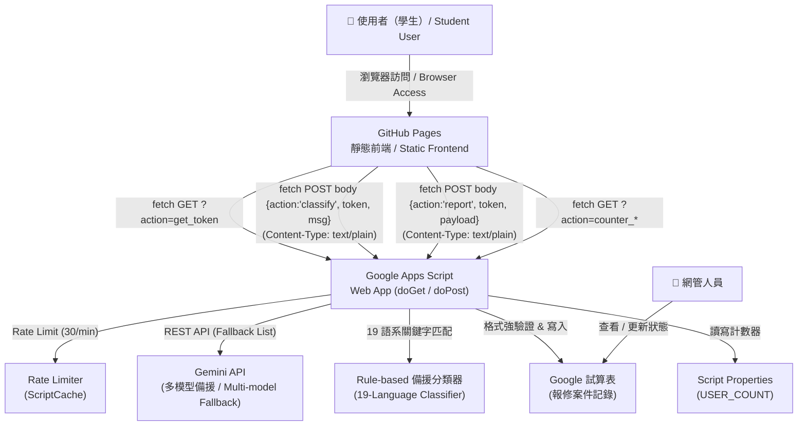

# 架構設計文件 (Architecture Design Document)

**版本 / Version**：3.0  
**最後更新 / Last Updated**：2026-08-08（Security Hardening: POST Body, One-time Token, Rate Limiting, 19-Language Fallback Classifier）

---

## 1. 系統架構概覽 (System Architecture Overview)


```mermaid
graph TD
    User["👤 使用者（學生）/ Student User"] -->|瀏覽器訪問 / Browser Access| GHP["GitHub Pages\n靜態前端 / Static Frontend"]
    GHP -->|"fetch GET ?action=get_token"| GAS["Google Apps Script\nWeb App (doGet / doPost)"]
    GHP -->|"fetch POST body {action:'classify', token, msg}\n(Content-Type: text/plain)"| GAS
    GHP -->|"fetch POST body {action:'report', token, payload}\n(Content-Type: text/plain)"| GAS
    GHP -->|"fetch GET ?action=counter_*"| GAS
    GAS -->|"Rate Limit (30/min)"| RateLimit["Rate Limiter\n(ScriptCache)"]
    GAS -->|"REST API (Fallback List)"| Gemini["Gemini API\n(多模型備援 / Multi-model Fallback)"]
    GAS -->|"19 語系關鍵字匹配"| RuleEngine["Rule-based 備援分類器\n(19-Language Classifier)"]
    GAS -->|"格式強驗證 & 寫入"| Sheet["Google 試算表\n(報修案件記錄)"]
    GAS -->|"讀寫計數器"| Props["Script Properties\n(USER_COUNT)"]
    Admin["👤 網管人員"] -->|"查看 / 更新狀態"| Sheet
```

---

## 2. 技術選型 (Technology Stack)

| 層次 / Layer | 技術 / Tech | 說明 / Description |
|---|---|---|
| 前端 / Frontend | HTML5 + Vanilla CSS + Vanilla JS | 無框架依賴，輕量且高速 / Lightweight & Zero dependencies |
| 部署 / Deployment | GitHub Pages | 免費靜態托管，自動 CI/CD / Free static hosting |
| LLM | Gemini API（多模型自動切換備援）| 透過 GAS 代理，API Key 絕不外露 / Proxied via GAS |
| 後端 / Backend | Google Apps Script (GAS Web App) | 無伺服器架構，`doGet` / `doPost` 路由 / Serverless |
| 資料儲存 / Data | Google 試算表 / Script Properties | 儲存通報案件與計數器 / Form data & Usage Counter |

---

## 3. 核心模組職責 (Core Modules)

### 3.1 前端模組 (`js/`)

| 模組 / Module | 職責 / Responsibilities |
|---|---|
| `config.js` | 集中管理 GAS URL、PDF 連結、雙語回覆文字 (`CONFIG.RESPONSES`)、`CONFIG.TEAMS` |
| `chat.js` | 對話流程控制、Token 初始化管理 (`_fetchToken`, `getToken`, `refreshToken`)、雙語按鈕渲染 |
| `intent.js` | 發送 POST Body (含 Token) 呼叫 GAS 進行意圖分類，支援 25s Timeout 與 Token 重試 |
| `report.js` | 報修表單 Modal 開關、學號格式強驗證 (`[A-Za-z][0-9]{7}`)、POST Body 送出與成功頁面切換 |
| `counter.js` | 讀取 / 累加使用人數，更新 Header 雙語數字 |
| `teams.js` | 開啟 Teams chat 深連結、平台備援跳轉、一鍵複製帳號名稱 |

### 3.2 後端 (`gas/Code.gs`)

| 函式 / Function | 職責 / Responsibilities |
|---|---|
| `doGet(e)` | 處理 `get_token` 發放及 `counter_*` 計數（拒絕敏感的 classify/report 請求）|
| `doPost(e)` | 解析 `text/plain` POST Body，執行 `_consumeToken` 驗證，路由至 `classify` / `report` |
| `_checkRateLimit(action, limit)` | 每分鐘請求速率限制（`classify`: 30/min, `report`: 10/min）|
| `classifyIntent(msg)` | 呼叫 Gemini 多模型 API，若配額用盡自動降級至 19 語系 Rule-based 備援分類器 |
| `writeReport(data)` | 後端學號/電話/床號格式強驗證、防 SQL/Script injection 長度截斷並寫入試算表 |
| `getCounter() / incrementCounter()` | Atomic LockService 防競態寫入計數器 |

---

## 4. 資料流 (Data Flow)

### 4.1 初始化 Token 發放
```
頁面載入 (DOMContentLoaded)
→ chat.js init() → _fetchToken()
→ fetch GET ?action=get_token
→ GAS _generateToken() (存入 ScriptCache 120 秒)
→ 回傳 { success: true, token: "uuid" } 存於記憶體變數
```

### 4.2 使用者輸入文字（意圖分類）
```
使用者輸入
→ chat.js _handleTextInput()
→ intent.js classify()
→ fetch POST GAS_URL (Content-Type: text/plain;charset=utf-8)
    body: { action: 'classify', msg: '...', token: '...' }
→ GAS doPost() → _consumeToken(token) 驗證
→ _checkRateLimit('classify', 30)
→ GAS classifyIntent() → Gemini API → 降級至 19 語系 _ruleBasedClassify
→ 回傳 { intent, confidence, needsConfirmation, topic }
```

### 4.3 報修送出
```
使用者填寫表單 (學號格式：[A-Za-z][0-9]{7}) → 點擊送出
→ report.js _validate() 前端強驗證
→ report.js _submitToGAS()
→ fetch POST GAS_URL (Content-Type: text/plain;charset=utf-8)
    body: { action: 'report', payload: reportData, token: '...' }
→ GAS doPost() → _consumeToken(token) 驗證
→ _checkRateLimit('report', 10) → writeReport() 後端格式雙重驗證
→ 寫入試算表 → 回傳 { success: true }
→ Modal 隱藏 header 標題列，僅顯示「報修成功！」與 2 秒進度條動畫
```

---

## 5. 安全性設計 (Security Architecture)

- **POST Body 通訊**：個資與使用者訊息不暴露於 URL / Web 伺服器 Log 中。
- **一次性 Token 驗證**：請求需攜帶短效 Session Token，不儲存於 localStorage / sessionStorage。
- **Content-Security-Policy (CSP)**：Strict CSP meta 標籤控制資安黑頭。
- **Rate Limit 限流**：使用 `CacheService` 實作每分鐘訪問頻率上限。
- **雙重格式強驗證與截斷**：前端與後端雙重審查學號、手機、床號格式與長度防護。
