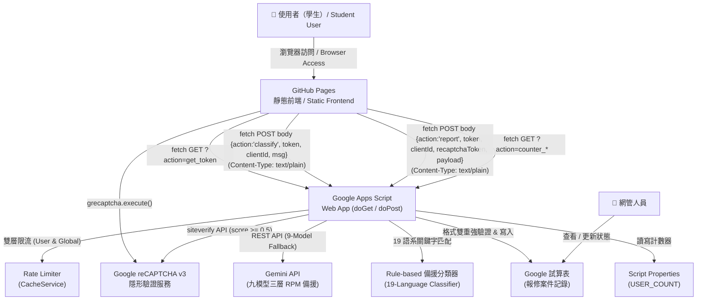

# 架構設計文件 (Architecture Design Document)

**版本 / Version**：3.1  
**最後更新 / Last Updated**：2026-08-08（Security Hardening: reCAPTCHA v3, Dual-Tier Rate Limiting, 9-Model Gemini Fallback Matrix, Client ID & Token Validation）

---

## 1. 系統架構概覽 (System Architecture Overview)


```mermaid
graph TD
    User["👤 使用者（學生）/ Student User"] -->|瀏覽器訪問 / Browser Access| GHP["GitHub Pages\n靜態前端 / Static Frontend"]
    GHP -->|"fetch GET ?action=get_token"| GAS["Google Apps Script\nWeb App (doGet / doPost)"]
    GHP -->|"fetch POST body {action:'classify', token, clientId, msg}\n(Content-Type: text/plain)"| GAS
    GHP -->|"fetch POST body {action:'report', token, clientId, recaptchaToken, payload}\n(Content-Type: text/plain)"| GAS
    GHP -->|"fetch GET ?action=counter_*"| GAS
    GHP -->|"grecaptcha.execute()"| reCAPTCHA["Google reCAPTCHA v3\n隱形驗證服務"]
    GAS -->|"雙層限流 (User & Global)"| RateLimit["Rate Limiter\n(CacheService)"]
    GAS -->|"siteverify API (score >= 0.5)"| reCAPTCHA
    GAS -->|"REST API (9-Model Fallback)"| Gemini["Gemini API\n(九模型三層 RPM 備援)"]
    GAS -->|"19 語系關鍵字匹配"| RuleEngine["Rule-based 備援分類器\n(19-Language Classifier)"]
    GAS -->|"格式雙重強驗證 & 寫入"| Sheet["Google 試算表\n(報修案件記錄)"]
    GAS -->|"讀寫計數器"| Props["Script Properties\n(USER_COUNT)"]
    Admin["👤 網管人員"] -->|"查看 / 更新狀態"| Sheet
```

---

## 2. 技術選型 (Technology Stack)

| 層次 / Layer | 技術 / Tech | 說明 / Description |
|---|---|---|
| 前端 / Frontend | HTML5 + Vanilla CSS + Vanilla JS | 無框架依賴，輕量且高速 / Lightweight & Zero dependencies |
| 部署 / Deployment | GitHub Pages | 免費靜態托管，自動 CI/CD / Free static hosting |
| LLM | Gemini API 九模型三層 RPM 分級自動備援 | 透過 GAS 代理，API Key 不外露；429 時自動重試切換下一個模型 |
| 備援 / Fallback | 19 語系 Rule-based 關鍵字分類器 | Gemini 全部失敗時降級使用，支援 19 種語言/地區語言 |
| 反濫用 / Anti-Abuse | reCAPTCHA v3（僅報修表單） | 隱形驗證，風險分數門檻 0.5，防止 GAS_URL 外洩後遭腳本濫用 |
| 後端 / Backend | Google Apps Script (GAS Web App) | 無伺服器架構，`doGet` / `doPost` 路由 / Serverless |
| 資料儲存 / Data | Google 試算表 / Script Properties | 儲存通報案件與計數器 / Form data & Usage Counter |
| 測試 / Testing | Node.js `node --test` + ESLint | 純 Node 原生測試框架，透過 `gas-mocks.js` 單元測試 GAS 邏輯 |

---

## 3. 核心模組職責 (Core Modules)

### 3.1 前端模組 (`js/`)

| 模組 / Module | 職責 / Responsibilities |
|---|---|
| `config.js` | 集中管理 GAS URL、RECAPTCHA_SITE_KEY、PDF 連結、雙語回覆文字 (`CONFIG.RESPONSES`)、`CONFIG.TEAMS` |
| `chat.js` | 對話流程控制、Token 初始化管理 (`_fetchToken`, `getToken`, `refreshToken`)、Client ID 管理 (`getClientId`) |
| `intent.js` | 發送 POST Body (含 Token + Client ID) 呼叫 GAS 進行意圖分類，支援 25s Timeout 與 Token 重試 |
| `report.js` | 報修表單 Modal 開關、學號/電話/床號前端格式強驗證、reCAPTCHA token 取得、POST Body 送出 |
| `counter.js` | 讀取 / 累加使用人數，更新 Header 雙語數字 |
| `teams.js` | 開啟 Teams chat 深連結、平台備援跳轉、一鍵複製帳號名稱 |

### 3.2 後端 (`gas/Code.gs`)

| 函式 / Function | 職責 / Responsibilities |
|---|---|
| `doGet(e)` | 處理 `get_token` 發放及 `counter_*` 計數（拒絕敏感的 classify/report 請求）|
| `doPost(e)` | 解析 `text/plain` POST Body，執行 `_consumeToken` 驗證，路由至 `classify` / `report` |
| `_checkRateLimit(action, limitPerMin, id, globalLimit)` | 雙層每分鐘請求速率限制（`classify`: 使用者 12/min·全域 60/min, `report`: 使用者 5/min·全域 20/min）|
| `_verifyRecaptcha(token, action)` | 呼叫 Google siteverify API 驗證 reCAPTCHA v3 token、action 及風險分數 (score ≥ 0.5) |
| `classifyIntent(msg, clientId)` | 依序呼叫 9 個 Gemini 模型，若配額用盡自動降級至 19 語系 Rule-based 備援分類器 |
| `writeReport(data, clientId, recaptchaToken)` | reCAPTCHA 驗證、後端學號/電話/床號格式強驗證、長度截斷寫入試算表 |
| `getCounter() / incrementCounter()` | Atomic LockService 防競態寫入計數器 |

### 3.3 Gemini 備援模型清單（依 RPM 配額分三層，共 9 個模型）

| 層級 | RPM | 模型 |
|---|---|---|
| 最高 | 15 | gemini-3.5-flash-lite、gemini-3.1-flash-lite |
| 中等 | 10 | gemini-2.5-flash-lite |
| 標準 | 5 | gemini-3.6-flash、gemini-3.5-flash、gemini-3-flash、gemini-2.5-flash |
| 穩定備援 | — | gemini-2.0-flash、gemini-2.0-flash-lite（最後保底）|

遇 HTTP 429（額度超限）：同一模型重試最多 2 次（間隔 1.5 秒）後切換下一個模型；
遇其他錯誤碼（400/403/404）直接跳下一個模型。9 個模型全部失敗時，降級至
`_ruleBasedClassify()`（19 語系關鍵字備援分類器）。

---

## 4. 資料流 (Data Flow)

### 4.1 初始化 Token 發放
```
頁面載入 (DOMContentLoaded)
→ chat.js init() → _fetchToken()
→ fetch GET ?action=get_token
→ GAS _generateToken() (存入 ScriptCache 120 秒)
→ 回傳 { success: true, token: "uuid" } 存於記憶體變數
```

### 4.2 使用者輸入文字（意圖分類）
```
使用者輸入
→ chat.js _handleTextInput()
→ 顯示打字指示器
→ intent.js classify()（AbortController 25 秒 Timeout）
→ POST GAS（Body: text/plain，內容：{action:"classify", msg, token, clientId}）
→ GAS doPost() 驗證 token（_consumeToken）
→ classifyIntent()：雙層流量限制（使用者 12/分鐘、全域 60/分鐘）
→ 依序嘗試 9 個 Gemini 模型（429 自動重試切換）
→ 全部失敗 → 降級 _ruleBasedClassify()（19 語系關鍵字比對）
→ 回傳 { intent, confidence, needsConfirmation, topic }
→ token 失效（INVALID_TOKEN）時前端自動重取 token 並重試一次
→ confidence < 0.6？顯示確認按鈕 : 根據意圖渲染對應回覆
```

### 4.3 報修送出
```
使用者填寫表單 → 點擊送出
→ report.js 前端驗證（必填欄位 + 學號 1字母+7數字 + 手機10位數字 + 床號1–3位數字）
→ grecaptcha.execute() 取得 reCAPTCHA v3 一次性 token（隱形驗證，無需使用者互動）
→ POST GAS（Body: text/plain，內容：{action:"report", payload, token, clientId, recaptchaToken}，
  AbortController 30 秒 Timeout）
→ GAS doPost() 驗證 token → writeReport()：
  → 雙層流量限制（使用者 5/分鐘、全域 20/分鐘）
  → _verifyRecaptcha()：驗證 token、action、風險分數 ≥ 0.5
  → 後端格式再次驗證（學號/手機/床號）
  → 寫入試算表（先設定儲存格為純文字格式，避免手機號碼開頭 0 被吃掉）
→ 回傳 {success:true}
→ Modal 顯示成功畫面（2 秒進度條後自動關閉）
```

---

## 5. 安全性設計 (Security Architecture)

- Gemini API Key、reCAPTCHA Secret Key 僅存於 **GAS Script Properties**，不寫入任何程式碼或 Git
- 所有含個資 / 使用者輸入之請求改為 **POST Body（text/plain）**，不暴露於 GET URL
- 一次性 Session Token（120 秒有效、用一次即失效）防止未授權或跨站偽造呼叫；
  取得 token 本身（`get_token`）因不含敏感資料，走 GET 即可
- 裝置級 Client ID（localStorage）+ 雙層 CacheService 限流
  （classify：12/分鐘·60/分鐘；report：5/分鐘·20/分鐘）
- reCAPTCHA v3 隱形驗證（僅報修表單），防止 GAS_URL 外洩後遭腳本大量濫用
- 學號 / 手機 / 床號前後端雙重格式驗證
- GAS Web App 設定「誰可以存取：所有人」以允許前端呼叫
- 前端不持有任何機密資訊
- `.env` 加入 `.gitignore`
