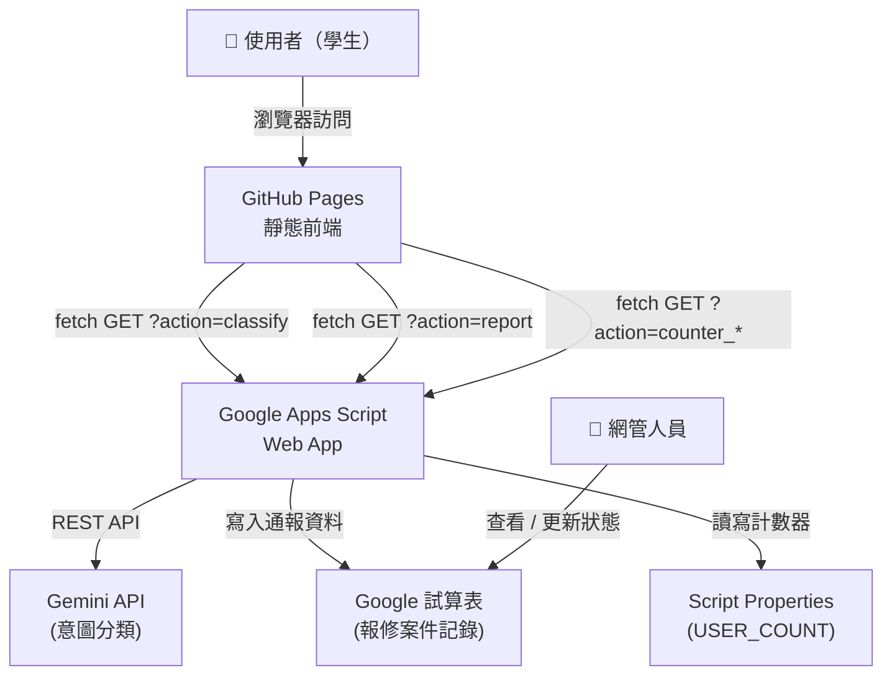

# 架構設計文件

**版本**：2.2  
**建立日期**：2026-07-17  
**最後更新**：2026-08-06（fix：Timeout 25s、Gemini 2.0 系列、topic 回傳欄位、手機優化記錄）

---

## 1. 系統架構概覽


```mermaid
graph TD
    User["👤 使用者（學生）"] -->|瀏覽器訪問| GHP["GitHub Pages\n靜態前端"]
    GHP -->|"fetch GET ?action=classify"| GAS["Google Apps Script\nWeb App"]
    GHP -->|"fetch GET ?action=report"| GAS
    GHP -->|"fetch GET ?action=counter_*"| GAS
    GAS -->|"REST API"| Gemini["Gemini API\n(意圖分類)"]
    GAS -->|"寫入通報資料"| Sheet["Google 試算表\n(報修案件記錄)"]
    GAS -->|"讀寫計數器"| Props["Script Properties\n(USER_COUNT)"]
    Admin["👤 網管人員"] -->|"查看 / 更新狀態"| Sheet
```

---

## 2. 技術選型

| 層次 | 技術 | 說明 |
|---|---|---|
| 前端 | HTML5 + Vanilla CSS + Vanilla JS | 無框架依賴，輕量部署 |
| 部署 | GitHub Pages | 免費靜態托管 |
| LLM | Gemini 2.0 Flash API（多模型備援） | 透過 GAS 代理，Key 不外露 |
| 後端 | Google Apps Script (GAS) | 免費、無需伺服器 |
| 資料儲存 | Google 試算表 | 報修案件；Script Properties 儲存計數器 |

---

## 3. 核心模組職責

### 3.1 前端模組（`js/`）

| 模組 | 職責 |
|---|---|
| `config.js` | 集中管理 GAS URL、PDF 連結、回覆文字、`CONFIG.TEAMS`、`CONFIG.INTENT_LABELS` |
| `chat.js` | 對話流程控制、訊息渲染、按鈕互動、低信心確認 UI、Teams Header 點擊處理 |
| `intent.js` | 呼叫 GAS 進行意圖分類，回傳 `{intent, confidence, needsConfirmation, isSystemError, topic}`；含 25 秒 Timeout |
| `report.js` | 報修表單 Modal 開關、前端驗證、送出至 GAS |
| `counter.js` | 讀取 / 累加使用人數，更新 Header 數字 |
| `teams.js` | 開啟 Teams chat 深連結、平台備援跳轉、一鍵複製帳號名稱 |

### 3.2 後端（`gas/Code.gs`）

| 函式 | 職責 |
|---|---|
| `doGet(e)` | 路由 GET 請求至對應功能 |
| `classifyIntent(msg)` | 呼叫 Gemini API，回傳 `{ intent, confidence, needsConfirmation, topic }`；Gemini 全失敗時降級至 Rule-based 備援 |
| `writeReport(data)` | 將報修資料附加至試算表 |
| `getCounter()` | 讀取 Script Properties 中的計數器 |
| `incrementCounter()` | 累加計數器 |

---

## 4. 資料流

### 4.1 使用者點擊按鈕

```
使用者點擊按鈕
→ chat.js _handleButtonClick()
→ 顯示打字指示器（模擬思考）
→ 渲染 Bot 回覆或開啟報修表單
```

### 4.2 使用者輸入文字（意圖分類）

```
使用者輸入
→ chat.js _handleTextInput()
→ 顯示打字指示器
→ intent.js classify()（含 AbortController 25 秒 Timeout）
→ GAS doGet(?action=classify&msg=...)
→ GAS classifyIntent() → Gemini API → 回傳 代碼|信心分數|子主題
→ 解析回傳 { intent, confidence, needsConfirmation, isSystemError, topic }
→ confidence < 0.6？顯示確認按鈕 : 根據意圖渲染對應回覆
→ BUTTON_SETTING 且 topic ≠ ALL：只顯示對應子主題卡片
```

### 4.4 Teams 常駐連結

```
使用者點擊 Header 「聯絡我們」按鈕
→ chat.js _handleTeamsClick()
→ 顯示備援說明水泡 + 一鍵複製按鈕
→ teams.js open()
    → 開啟 Teams chat 深連結
    → 2.5秒後側測 document.hidden
        → 頁面隱藏（App 被喚起）→ 不做任何事
        → 頁面仍顯示（App 未安裝）→ 跳轉備援 URL
```

### 4.3 報修送出

```
使用者填寫表單 → 點擊送出
→ report.js 前端驗證（必填欄位）
→ fetch GAS doGet(?action=report&payload=...)
→ GAS writeReport() → 試算表 appendRow()
→ 回傳 {success:true}
→ 關閉 Modal，顯示成功訊息
```

---

## 5. 安全性設計

- Gemini API Key 僅存於 **GAS Script Properties**，不寫入任何程式碼或 Git
- GAS Web App 設定「誰可以存取：所有人」以允許前端呼叫
- 前端不持有任何機密資訊
- `.env` 加入 `.gitignore`

---

## 6. 部署流程

```
1. 完成本地開發 → git push feature/chatbot-init
2. 開 Pull Request → main
3. 合併後：Settings → Pages → Source: main / (root)
4. 部署 GAS，取得 Web App URL
5. 更新 js/config.js → GAS_URL
6. 再次 commit + push
```
