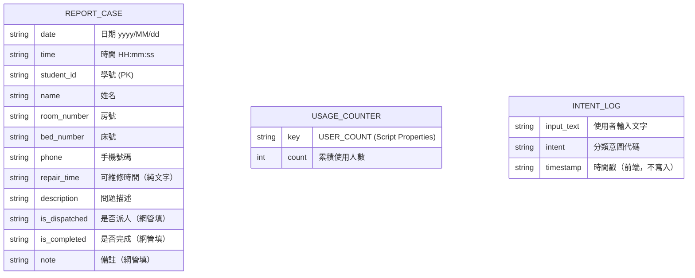

# 資料模型文件

**版本**：1.0  
**建立日期**：2026-07-17

---

## 1. 實體關聯圖（ER Diagram）

---

## 2. 核心實體說明

### 2.1 報修案件（REPORT_CASE）

儲存於 Google 試算表（Spreadsheet ID: `1BUnG_NNaxU-oBFPKY-rZ0xWyxAzG-A_AVOsw07X79uI`）

| 欄位 | 資料型別 | 來源 | 說明 |
|---|---|---|---|
| date | String | 系統自動 | 通報日期 yyyy/MM/dd |
| time | String | 系統自動 | 通報時間 HH:mm:ss |
| student_id | String | 學生填寫 | 必填 |
| name | String | 學生填寫 | 必填 |
| room_number | String | 學生填寫 | 必填，例：A123 |
| bed_number | String | 學生填寫 | 必填，例：1 |
| phone | String | 學生填寫 | 必填 |
| repair_time | String | 學生填寫 | 必填，純文字，不驗證格式 |
| description | String | 學生填寫 | 必填 |
| is_dispatched | String | 網管填寫 | 空白預設，由網管手動更新 |
| is_completed | String | 網管填寫 | 空白預設，由網管手動更新 |
| note | String | 網管填寫 | 空白預設 |

### 2.2 累積使用人數（USAGE_COUNTER）

儲存於 GAS Script Properties

| 鍵 | 類型 | 說明 |
|---|---|---|
| USER_COUNT | String（parseInt 使用） | 累積服務人數，每次新 session +1 |

### 2.3 意圖分類（INTENT_LOG）

僅存於前端記憶體，不寫入持久化儲存

| 意圖代碼 | 說明 |
|---|---|
| BUTTON_TEACH | 教學相關 |
| BUTTON_SETTING | 常見設定問題（轉接器） |
| BUTTON_REPORT | 主動要求報修 |
| STICKER_PORT | IP 貼紙缺漏 / 網路孔故障 |
| NON_NETWORK | 非網管業務 |
| UNKNOWN | 無法判斷 |

---

## 3. 資料驗證規則

| 欄位 | 前端驗證 | GAS 端驗證 |
|---|---|---|
| 姓名 | 不得為空 | 存入原始值 |
| 學號 | 不得為空 | 存入原始值 |
| 房號 | 不得為空 | 存入原始值 |
| 床號 | 不得為空 | 存入原始值 |
| 手機 | 不得為空 | 存入原始值 |
| 可維修時間 | 不得為空（不驗證格式）| 存入原始值 |
| 問題描述 | 不得為空 | 存入原始值 |

---

## 4. 資料生命週期

| 資料 | 建立 | 更新 | 刪除 |
|---|---|---|---|
| 報修案件 | 使用者送出表單時 | 網管人員手動更新試算表 | 不刪除（永久保存） |
| 累積計數器 | 首次呼叫 increment 時 | 每次新 session | 不刪除 |
