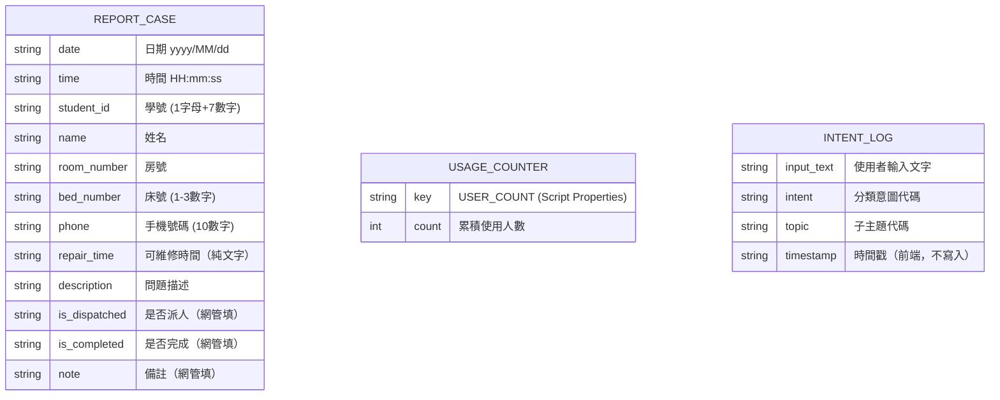

# 資料模型文件 (Data Model Specification)

**版本 / Version**：v1.4.5  
**建立日期 / Created**：2026-07-17  
**最後更新 / Last Updated**：2026-08-29 (v1.4.5: 版本號對齊；本次稽核未變更資料模型)

---

## 1. 實體關聯圖（ER Diagram）

```mermaid
erDiagram
    REPORT_CASE {
        string date          "日期 yyyy/MM/dd"
        string time          "時間 HH:mm:ss"
        string student_id    "學號 (1字母+7數字)"
        string name          "姓名"
        string room_number   "房號"
        string bed_number    "床號 (1-3數字)"
        string phone         "手機號碼 (10數字)"
        string repair_time   "可維修時間（純文字）"
        string description   "問題描述"
        string is_dispatched "是否派人（網管填）"
        string is_completed  "是否完成（網管填）"
        string note          "備註（網管填）"
    }

    USAGE_COUNTER {
        string key   "USER_COUNT (Script Properties)"
        int    count "累積使用人數"
    }

    INTENT_LOG {
        string input_text "使用者輸入文字"
        string intent     "分類意圖代碼"
        string topic      "子主題代碼"
        string timestamp  "時間戳（前端，不寫入）"
    }
```

---

## 2. 核心實體說明

### 2.1 報修案件（REPORT_CASE）

儲存於 Google 試算表（試算表 ID 存於 **GAS Script Properties**，鍵名 `SPREADSHEET_ID`；
**不於文件或程式碼中公開實際 ID**——這點在 `.env.example` 中也有明文規定）。

| 欄位             | 資料型別   | 來源   | 格式與驗證規則                                        |
| -------------- | ------ | ---- | ------------------------------------------------ |
| date           | String | 系統自動 | 通報日期 yyyy/MM/dd                                  |
| time           | String | 系統自動 | 通報時間 HH:mm:ss                                    |
| student_id    | String | 學生填寫 | 必填；1 位英文字母 + 7 位數字（如 D1234567），前後端雙重 RegEx 驗證 |
| name           | String | 學生填寫 | 必填；最長 50 字                                       |
| room_number   | String | 學生填寫 | 必填，例：A123                                       |
| bed_number    | String | 學生填寫 | 必填；1–3 位數字，前後端雙重 RegEx 驗證                      |
| phone          | String | 學生填寫 | 必填；10 位數字，前後端雙重 RegEx 驗證                       |
| repair_time   | String | 學生填寫 | 必填，純文字（如 18:00–21:00）                          |
| description    | String | 學生填寫 | 必填；最長 200 字                                      |
| is_dispatched | String | 網管填寫 | 空白預設，由網管手動更新                                     |
| is_completed  | String | 網管填寫 | 空白預設，由網管手動更新                                     |
| note           | String | 網管填寫 | 空白預設                                             |

> 🔒 送出前另需通過 **reCAPTCHA v3 隱形驗證**（風險分數 ≥ 0.5），詳見 `doc/architecture.md` §5。

### 2.2 累積使用人數（USAGE_COUNTER）

儲存於 GAS Script Properties

| 鍵 | 類型 | 說明 |
|---|---|---|
| USER_COUNT | String（parseInt 使用） | 累積服務人數，每次新 session +1 |

> 計數器流量限制依 `clientId` 個別計算（每人每分鐘 3 次），全域上限為每分鐘 500 次，
> 透過 LockService 確保原子性寫入，防止競態條件（Race Condition）造成計數錯誤。

### 2.3 意圖分類（INTENT_LOG）

僅存於前端記憶體，不寫入持久化儲存

| 意圖代碼 | 說明 | 子主題 (Topic) |
|---|---|---|
| BUTTON_TEACH | 教學相關 | NONE |
| BUTTON_SETTING | 常見問題（轉接器、WiFi 帳號密碼、寢室 WiFi 等） | ACCOUNT / ADAPTER / WIFI_SIGNAL / AC_BILLING / ALL |
| BUTTON_REPORT | 主動要求報修 | NONE |
| BUTTON_QUERY | 報修案件查詢（v1.4.0 新增） | NONE |
| STICKER_PORT | IP 貼紙缺漏 / 網路孔故障 | NONE |
| NON_NETWORK | 非網管業務 | NONE |
| UNKNOWN | 無法判斷 | ALL |

---

## 3. 資料驗證規則矩陣 (Validation Matrix)

> ⚠️ **v1.3.1 修正**：下表原本把後端驗證描述為「僅長度截斷」，但實際上
> `writeReport()` 對每個欄位都是**先必填、後格式、再截斷**三階段驗證
> （BUG-01 修復前，空字串會因 `field && !regex.test(field)` 的短路寫法
> 整段跳過驗證，等同必填形同虛設；v1.3.1 已修正）。下表已對照 `gas/Code.gs`
> 目前實際邏輯逐欄核實更新。

| 欄位 | 前端驗證 (RegEx / MaxLen) | GAS 後端驗證（v1.3.1：必填 → 格式 → 截斷） |
|---|---|---|
| 姓名 | 不得為空（最長 50 字） | 必填（trim 後不得為空字串）+ 截斷 `slice(0, 50)` |
| 學號 | 必填；`/^[a-zA-Z][0-9]{7}$/` (如 D1234567) | 必填 + 格式驗證 `!/^[a-zA-Z][0-9]{7}$/` + 截斷 8 字 |
| 房號 | 必填（最長 8 字） | 必填 + 格式驗證 `!/^[A-Za-z0-9-]{1,8}$/`（僅限英數字與連字號）+ 截斷 8 字 |
| 床號 | 必填；`/^[0-9]{1,3}$/` | 必填 + 格式驗證 `!/^[0-9]{1,3}$/` + 截斷 3 字 |
| 手機 | 必填；`/^[0-9]{10}$/` | 必填 + 格式驗證 `!/^[0-9]{10}$/` + 截斷 10 字 |
| 可維修時間 | 小時 0–23、分鐘 0–59 範圍驗證 | 截斷 `slice(0, 20)`（純文字欄位，後端無格式 RegEx，僅做長度防護）|
| 問題描述 | 必填（最長 200 字） | 必填（trim 後不得為空字串）+ 截斷 `slice(0, 200)` |

**重要澄清**：在 v1.3.1 之前，攻擊者只要繞過前端、直接對 GAS Web App 送出
studentId / phone / bedNumber / roomNumber / name / description 皆為**空字串**
的請求，後端會因為上述短路寫法的缺陷而**照樣寫入試算表**，等同後端「必填」
從未真正生效過。此問題與試算表資料品質直接相關，故列於本文件而非僅列於
`architecture.md`。

---

## 4. 資料生命週期

| 資料 | 建立 | 更新 | 刪除 |
|---|---|---|---|
| 報修案件 | 使用者送出表單時（經 reCAPTCHA v3 + Token 驗證） | 網管人員手動更新試算表 | 不刪除（永久保存） |
| 累積計數器 | 首次呼叫 increment 時 | 每次新 session (Atomic LockService) | 不刪除 |

